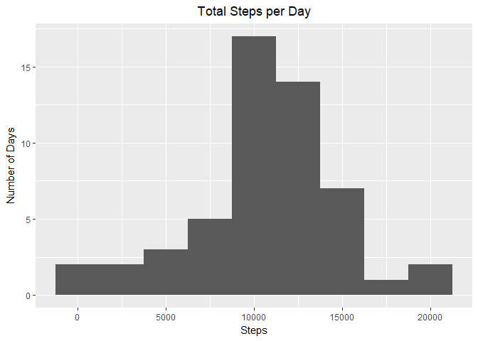
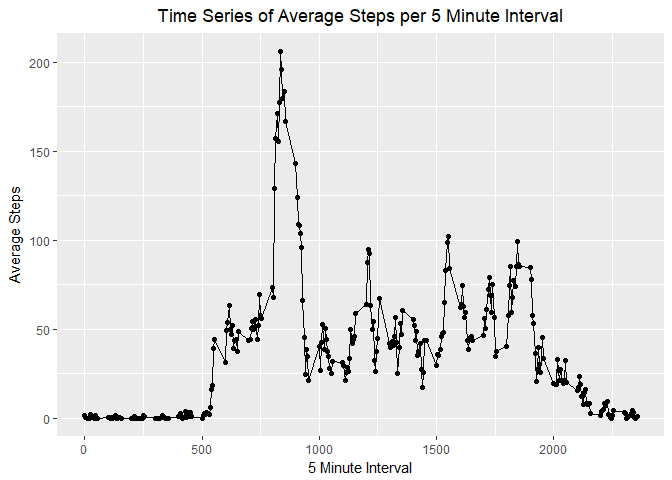
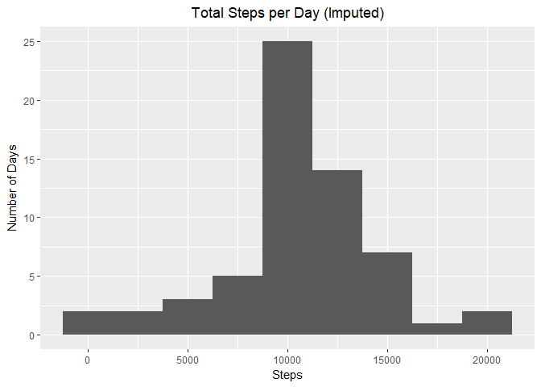
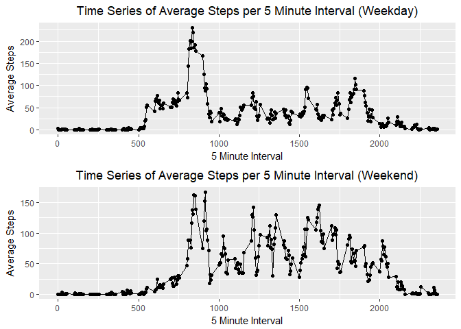

## Loading and preprocessing the data

```r
#load packages
library(knitr)
```

```
## Warning: package 'knitr' was built under R version 3.4.4
```

```r
library(dplyr)
```

```
## Warning: package 'dplyr' was built under R version 3.4.3
```

```
## 
## Attaching package: 'dplyr'
```

```
## The following objects are masked from 'package:stats':
## 
##     filter, lag
```

```
## The following objects are masked from 'package:base':
## 
##     intersect, setdiff, setequal, union
```

```r
library(ggplot2)
```

```
## Warning: package 'ggplot2' was built under R version 3.4.4
```

```r
library(gridExtra)
```

```
## Warning: package 'gridExtra' was built under R version 3.4.4
```

```
## 
## Attaching package: 'gridExtra'
```

```
## The following object is masked from 'package:dplyr':
## 
##     combine
```

```r
#import data
activity <- read.csv(file="activity.csv", header = TRUE, stringsAsFactors = FALSE)
#change the date variable from character to date
activity$date <- as.Date(activity$date, "%Y-%m-%d")
```

## What is mean total number of steps taken per day?

```r
#aggregate and sum to achieve total steps per day
stepsByDay <- aggregate(steps ~ date, activity, sum)
#create and print a histogram of steps per day
stepHist <- ggplot(stepsByDay, aes(steps)) + geom_histogram(binwidth = 2500) + labs(title = "Total Steps per Day",x = "Steps", y = "Number of Days") + theme(plot.title = element_text(hjust=0.5))
print(stepHist)
```

<!-- -->

```r
#calculate the mean and median of steps per day and print to the console
meanSteps <- mean(stepsByDay$steps)
medSteps <- median(stepsByDay$steps)
cat("Mean steps per day: ", meanSteps)
```

```
## Mean steps per day:  10766.19
```

```r
cat("\nMedian steps per day: ", medSteps)
```

```
## 
## Median steps per day:  10765
```

## What is the average daily activity pattern?

```r
#aggregate and average to get average steps per 5 minute interval
avgInt <- aggregate(steps ~ interval, activity, mean)
#create and print a line time series plot to show average steps over 5 minute intervals
intLine <- ggplot(avgInt, aes(x=interval, y=steps)) + geom_line() + geom_point() + labs(title = "Time Series of Average Steps per 5 Minute Interval",x = "5 Minute Interval",y = "Average Steps") + theme(plot.title = element_text(hjust=0.5))
print(intLine)
```

<!-- -->

```r
#find the maximum average steps for a 5 minute interval, strip the values into new variables, print the result to the console
maxInt <- avgInt[which(avgInt$steps==max(avgInt$steps)),]
maxIntRge <- maxInt$interval
maxIntVal <- maxInt$steps
cat("\nMaximum Interval and Steps: ", maxIntRge, " - ", maxIntVal)
```

```
## 
## Maximum Interval and Steps:  835  -  206.1698
```

```r
naInt <- sum(is.na(activity$steps))
cat("\nMissing Values: ", naInt)
```

```
## 
## Missing Values:  2304
```

## Imputing missing values

```r
#create merged data set that will use the average(mean) steps by interval to impute missing data
impSteps <- merge(activity, avgInt, by = "interval")
#transform the dataframe to impute missing values
impSteps <- transform(impSteps, steps = ifelse(is.na(steps.x),steps.y,steps.x))
#choose and reorder columns to match activity dataframe, while sorting by date and interval
impSteps <- impSteps[order(impSteps$date, impSteps$interval),c(1, 5, 3)]
#follow previous steps to aggregate & sum total steps, produce histogram, and print info to the console
stepsByDayImp <- aggregate(steps ~ date, impSteps, sum)
stepHistImp <- ggplot(stepsByDayImp, aes(steps)) + geom_histogram(binwidth = 2500) + labs(title = "Total Steps per Day (Imputed)",x = "Steps", y = "Number of Days") + theme(plot.title = element_text(hjust=0.5))
print(stepHistImp)
```

<!-- -->

```r
meanStepsImp <- mean(stepsByDayImp$steps)
medStepsImp <- median(stepsByDayImp$steps)
cat("\nMean steps per day (after Impute): ", meanStepsImp)
```

```
## 
## Mean steps per day (after Impute):  10766.19
```

```r
cat("\nMedian steps per day (after Impute): ", medStepsImp)
```

```
## 
## Median steps per day (after Impute):  10766.19
```

## Are there differences in activity patterns between weekdays and weekends?

```r
#create dataframe to check for differences by day of the week using the imputed dataframe
impSteps$weekday <- weekdays(impSteps$date, abbreviate = TRUE)
#determine if weekday or weekend
impSteps$daytype <- as.factor(ifelse(impSteps$weekday %in% c('Sat','Sun'), 'Weekend', 'Weekday'))
#aggregate and average to get average steps per 5 minute interval for Weekdays
avgIntWkd <- aggregate(steps ~ interval, impSteps[impSteps$daytype == 'Weekday',], mean)
#create and print a line time series plot to show average steps over 5 minute intervals
intLineWkd <- ggplot(avgIntWkd, aes(x=interval, y=steps)) + geom_line() + geom_point() + labs(title = "Time Series of Average Steps per 5 Minute Interval (Weekday)",x = "5 Minute Interval",y = "Average Steps") + theme(plot.title = element_text(hjust=0.5))
#aggregate and average to get average steps per 5 minute interval for Weekends
avgIntWke <- aggregate(steps ~ interval, impSteps[impSteps$daytype == 'Weekend',], mean)
#create and print a line time series plot to show average steps over 5 minute intervals
intLineWke <- ggplot(avgIntWke, aes(x=interval, y=steps)) + geom_line() + geom_point() + labs(title = "Time Series of Average Steps per 5 Minute Interval (Weekend)",x = "5 Minute Interval",y = "Average Steps") + theme(plot.title = element_text(hjust=0.5))
grid.arrange(intLineWkd, intLineWke, nrow = 2)
```

<!-- -->
